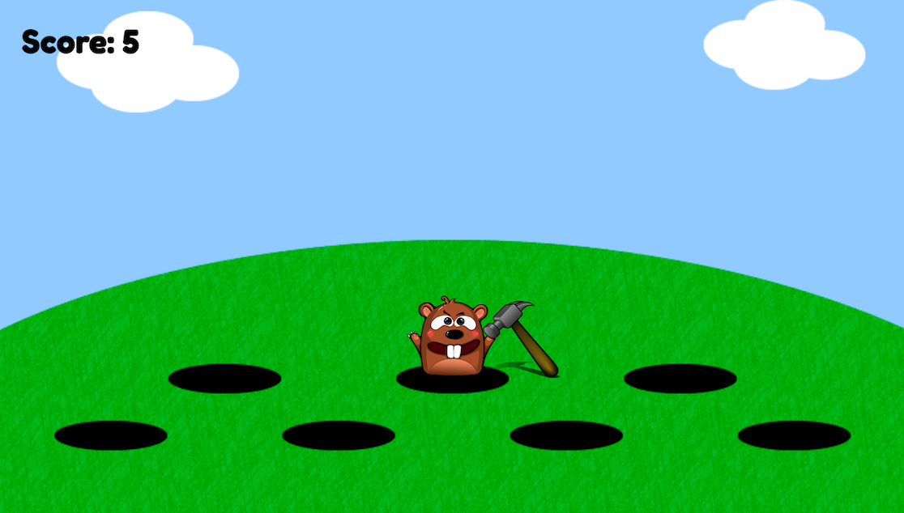

# Whac A Mole 

This is a Whac A Mole game built with Tensorflow and Posenet and is based on Charlie Gerald's (https://github.com/charliegerard) blog post on how she built her Beat Saber clone with hand movements using pose estimation. Here is the post:  https://dev.to/devdevcharlie/playing-beat-saber-in-the-browser-with-body-movements-using-posenet-tensorflow-js-36km.
My game is 2D (whilst hers uses A-frame) so aside from the camera and poses setup, I wrote all the logic myself. 

## Demo

You can play the game here: 

## Stack

- HTML
- CSS
- JavaScript
- Tensorflow.js & PoseNet

## Game

Once the user's right wrist is detected using their webcam, they can start hitting the moles that pop up every 2 seconds from random holes. Every time the user hits a mole, they gain a point!




## Interesting snippets

This is the interval that allows the mole to pop up every two seconds:

```javascript
// choose a random hole every 2 seconds for the mole to pop up from
setInterval(() => {
  if (hide) {
    hole = Math.floor(Math.random() * Math.floor(7))
  } else {
    hole = 7
  }
  // I added one second pause in between the mole swapping holes to make the game more 'realistic'
  hide = !hide
}, 1000) 
```

This is the function that draws the mole and the hammer at every pose detection:

```javascript
poses.forEach(({ score, keypoints }) => {
  if (score >= minPoseConfidence) {
    if (poseNetState.output.showPoints) {
      const { x, y } = moleCoordinates[hole]
      // draw the mole
      drawOneMole(ctx, x, y, 1)
      // draw the hammer
      drawKeypoints(keypoints, minPartConfidence, ctx)
    }
  }
})
```

This is the function that draws the hammer on the right hand wrist 'keypoint' of the player

```javascript
function drawKeypoints(keypoints, minConfidence, ctx, scale = 1) {
    const rightWrist = keypoints.find(point => point.part === 'rightWrist')
    const imageRight = document.querySelector('#right')
    
    if (rightWrist.score > minConfidence) {
      const { y, x } = rightWrist.position
      // renaming mole coordinates to avoid confusion with wrist one..
      const xMole = moleCoordinates[hole]['x']
      const yMole = moleCoordinates[hole]['y']
      drawPoint(ctx, y * scale, x * scale, 10, imageRight)
      checkCollision(x, y, xMole, yMole)
    }
  }
```

This is the function that checks if the hammer is being drawn within 25px radius from the mole, which means that the user hit a mole with the hammer 🔨

```javascript
function checkCollision(x, y, xMole, yMole) {
  if (x <= xMole + 25 && x >= xMole - 25) {
    if (y <= yMole + 25 || y >= yMole - 25) {
      score += 1
      scoreKeeper.innerHTML = `Score: ${score}`
    }
  }
}
```

## Challenges

This was my first time working on so many and quite advanced promises & async functions. It definitely helped me deeped my understanding of how they work and why one would need to use them!

## Future

In the future, I'm going to make the moles move faster between holes as the user gets better!


